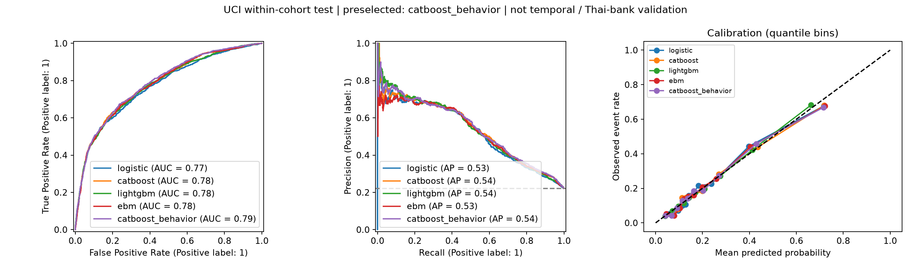

# ผลทดลอง credit risk รอบแรก

วันที่ 4 ตุลาคม 2026 — `experiment_v1` — งานวิจัยที่ไม่ใช่เชิงพาณิชย์

## ผลที่ควรเข้าใจก่อน

**โมเดลที่เลือกไว้ก่อนดูผล test คือ `catboost_behavior`** ใช้ validation log loss หลัง calibration เป็นเกณฑ์ ไม่เปลี่ยน champion ตามผล test โมเดลนี้ทำนาย label ของลูกหนี้บัตรเครดิตใน UCI cohort ได้ตามตัวเลขด้านล่าง ยังไม่ใช่โมเดลที่พิสูจน์แล้วสำหรับผู้สมัครใหม่ SME หรือธนาคารไทย

เทียบ Logistic บน test เดียวกัน: AUC ต่าง +0.01684; log loss ต่าง -0.01080 (ค่าติดลบสำหรับ log loss หมายถึงดีขึ้น) เป็นผลของการทดลองขอบเขตนี้ ไม่ใช่การจัดอันดับโมเดลทั่วโลก

## 1. ตรวจข้อมูลจริงก่อนฝึก

- โหลดต้นฉบับ XLS และ CSV ที่ UCI API ระบุ พร้อม Kaggle CSV และ metadata; เทียบทุกค่าหลังจับคู่ชื่อคอลัมน์ พบต่างกัน **0 เซลล์สำหรับ CSV และ 0 เซลล์สำหรับ XLS** ชนิดข้อมูลบางคอลัมน์ต่างกัน แต่ค่าตัวเลขตรงกัน
- 30,000 แถว, 23 predictors, ID และ target แยกออก; พบ label 1 จำนวน 6,636 (22.12%) และ null 0 เซลล์
- เมื่อเอา ID/target ออก พบแถวซ้ำส่วนเกิน 56 แถว และ 21 กลุ่มมี predictor เหมือนกันแต่ label ต่างกัน เก็บทั้งหมด ไม่เดาว่าคนเดียวกัน ไม่ลบหรือแก้ label
- พบ EDUCATION 0/5/6, MARRIAGE 0 และ repayment -2/0 ที่ dictionary ที่ตรวจอธิบายไม่ครบ เก็บเป็นหมวดหมู่เฉพาะ ไม่ remap ตามความจำ
- ค่า BILL_AMT ติดลบยังเก็บไว้; ไม่สรุปว่าเป็น error จากเครื่องหมายเพียงอย่างเดียว รายละเอียด domains, ranges, negative counts และ SHA-256 อยู่ใน `data_audit.json`
- Kaggle metadata ระบุ CC0 ขณะที่ต้นทาง UCI ระบุ CC BY 4.0 จึงรักษาการอ้างต้นทางและผู้สร้าง ไม่อนุมานว่าผู้ทำ mirror มีสิทธิ์เปลี่ยนเป็น public domain

ที่มาและการอ้างข้อมูล: I-Cheng Yeh (2009), *Default of Credit Card Clients*, UCI, DOI [10.24432/C55S3H](https://doi.org/10.24432/C55S3H), [ต้นทางและ CC BY 4.0](https://archive.ics.uci.edu/dataset/350/default+of+credit+card+clients), [Kaggle mirror](https://www.kaggle.com/datasets/uciml/default-of-credit-card-clients-dataset).

## 2. แยกข้อมูลตามหน้าที่

| ชุด | แถว | เหตุการณ์ | สัดส่วนเหตุการณ์ |
| --- | --- | --- | --- |
| fit | 16500 | 3649 | 22.115% |
| validation | 4500 | 996 | 22.133% |
| calibration | 4500 | 996 | 22.133% |
| test | 4500 | 995 | 22.111% |

จัดกลุ่ม predictor ที่เหมือนกันก่อนแบ่งด้วย StratifiedGroupKFold 20 folds แล้วแบ่ง folds เป็นสี่หน้าที่ตาม protocol ไม่มีกลุ่มดังกล่าวข้าม partition การแบ่งนี้ลดการปนของ exact duplicate vectors แต่ไม่ได้รับรอง borrower identity หรือ near-duplicate independence

- Fit: เรียนรู้พารามิเตอร์ของโมเดล
- Validation: เลือก setting ของโมเดล แล้วเลือก pipeline หลัง calibration
- Calibration: เลือก identity/sigmoid/isotonic จาก out-of-fold log loss ภายในชุดนี้ และ fit calibrator ที่เลือกบนชุด calibration ทั้งชุด; base model คงเดิม
- Test: ประเมินโมเดลที่ล็อกแล้ว; ไม่ใช้เลือก feature, hyperparameter หรือ champion ใหม่

## 3. สิ่งที่ทดลองจริง

Logistic C=0.1/1/10; CatBoost depth=4/6/8, 600 trees; LightGBM leaves=15/31/63, 500 trees; EBM interactions=0/5, max rounds=1500, outer bags=4 ใช้ 4 threads และ seed=20261004 ไม่เปิด class weighting/SMOTE

มี CatBoost อีก candidate เพิ่ม payment-to-positive-bill ratios 6 เดือน, flags สำหรับบิลที่ไม่เป็นบวก, recent bill utilization และผลต่างบิลเดือน 1 กับ 6 โดย denominator ที่ไม่เป็นบวกให้ ratio เป็น missing พร้อม flag; ใช้ setting ที่เลือกจาก raw CatBoost เป็น ablation ที่ประกาศก่อนดู test

ทุกโมเดลใช้ข้อมูล fit เดียวกันใน main track แต่จำนวน setting และโครงสร้าง computation ต่างกัน นี่เป็น bounded baseline experiment ไม่ใช่การค้นหาเท่ากันด้วย compute budget หรือ exhaustive SOTA benchmark

| โมเดล | calibrator | เวลา fit/search/calibration (วินาที) | ทำนาย test batch (วินาที) | validation calibrated log loss |
| --- | --- | --- | --- | --- |
| logistic | identity | 3.6 | 0.03 | 0.42634 |
| catboost | identity | 484.1 | 0.04 | 0.41495 |
| lightgbm | sigmoid | 24.3 | 0.15 | 0.42073 |
| ebm | identity | 17.8 | 0.01 | 0.41836 |
| catboost_behavior | identity | 91.7 | 0.05 | 0.41448 |

เวลาที่รายงานรวมการค้นหา/ฝึก/calibration ตาม pipeline มีการรัน CPU jobs พร้อมกัน จึงไม่ใช่ latency benchmark ในสภาวะเครื่องว่าง

## 4. ผลบน test ที่ไม่ใช้เลือกโมเดล

Test 4,500 แถว, label 1 995, prevalence 22.111%

| โมเดล | ROC-AUC ↑ | Average precision ↑ | Log loss ↓ | Brier ↓ |
| --- | --- | --- | --- | --- |
| logistic | 0.76923 | 0.52551 | 0.43979 | 0.13805 |
| catboost | 0.78159 | 0.54011 | 0.43073 | 0.13558 |
| lightgbm | 0.77670 | 0.53949 | 0.43275 | 0.13637 |
| ebm | 0.78022 | 0.52802 | 0.43432 | 0.13692 |
| catboost_behavior | 0.78608 | 0.54212 | 0.42899 | 0.13541 |

อ่าน metric:

- **ROC-AUC**: จัดอันดับความเสี่ยงได้ดีเพียงใด; 0.5 เป็นระดับสุ่มสำหรับการจัดอันดับ ไม่ใช่ accuracy
- **Average precision**: คุณภาพการจัดอันดับคลาสผิดนัด; ต้องอ่านคู่ prevalence นี้ ไม่เรียกเป็น trapezoidal PR-AUC
- **Log loss**: ลงโทษ probability ที่ผิด โดยเฉพาะมั่นใจผิด; ต่ำดีกว่า
- **Brier**: ค่าเฉลี่ยกำลังสองของความคลาดเคลื่อน probability; ต่ำดีกว่า แต่รวมทั้ง calibration/discrimination จึงไม่ใช้แทน calibration ทั้งหมด

Calibration ของ champion บน test: intercept=-0.0491, slope=0.9710 ค่าที่สอดคล้อง ideal model คือ 0 และ 1 ตามลำดับ เป็น descriptive diagnostic ไม่ได้นำกลับไปปรับโมเดลบน test

หากขั้นเลือก calibrator ได้ `identity` หมายถึงคง probability เดิม เพราะตัวเลือกนี้มี out-of-fold log loss ต่ำสุดใน calibration partition ไม่ได้แปลว่าพิสูจน์ perfect calibration แล้ว

95% group-bootstrap intervals (300 replicates) ของ champion:

- AUC [0.77107, 0.80365]
- Log loss [0.41185, 0.44480]
- AUC ต่างจาก Logistic [+0.00877, +0.02744]
- Log loss ต่างจาก Logistic [-0.01580, -0.00609]

Intervals เหล่านี้อธิบายความไม่แน่นอนภายใน cohort ภายใต้หน่วย resampling ที่ระบุ ไม่ใช่ temporal stability, multiplicity-adjusted discovery หรือการรับรอง performance ของ cohort อนาคต



## 5. TabPFN: แยกขนาดข้อมูลให้ชัด

สถานะที่วัดจริง: v2: tabpfn=ok, catboost=ok; v3.5: tabpfn=ok

ใช้ fit 1,000 แถว validation 400 และ calibration 600 แถวจาก subset ที่ล็อกก่อนทดลอง; ทำนาย test 4,500 แถวเดียวกับ main track มี CatBoost fit 1,000 แถวเหมือนกันเป็น comparator ไม่เอาผลนี้ไปอ้างว่า TabPFN แพ้/ชนะโมเดลที่ได้ข้อมูลฝึก 16,500 แถวอย่างเท่าเทียม

| โมเดลข้อมูลย่อย | ROC-AUC ↑ | AP ↑ | Log loss ↓ | Brier ↓ |
| --- | --- | --- | --- | --- |
| aux_tabpfn_v2 | 0.76445 | 0.51153 | 0.44193 | 0.13919 |
| aux_catboost_1000 | 0.75560 | 0.49598 | 0.44865 | 0.14197 |
| aux_tabpfn_v3.5 | 0.77284 | 0.52540 | 0.43485 | 0.13651 |

| โมเดลข้อมูลย่อย | calibrator | fit/preprocessing/calibration (วินาที) | ทำนาย test batch (วินาที) |
| --- | --- | --- | --- |
| tabpfn v2 | identity | 107.37 | 302.18 |
| catboost catboost_fixed_depth6 | sigmoid | 122.91 | 0.12 |
| tabpfn v3.5 | identity | 40.08 | 159.85 |

TabPFN ใช้ local CPU inference, 2 ensemble estimators และระบุ categorical features รุ่นจริง เวลาและ calibrator ดู `tabpfn*_trial.json` รุ่น 3.5 เคยติด authentication/license gate ก่อนผู้ใช้มี key ดูประวัติใน diagnostics; ห้ามเรียกผล V2 ว่า V3.5

เวลา fit ของ TabPFN ในตารางรวมการเตรียม context/preprocessing และการเลือก calibration ไม่ใช่การฝึกน้ำหนัก foundation model ใหม่ เวลารันแต่ละ trial เกิดคนละช่วงและอาจมีงาน CPU อื่น จึงไม่ใช้เป็น controlled speed benchmark รุ่น 3.5 เป็น auxiliary addendum ที่ประกาศไว้ก่อน แต่เข้าถึงได้หลังประเมิน main test แล้ว ไม่เปลี่ยน champion หรือตั้งค่าจากผล test นี้

## 6. ขอบเขตและสิ่งที่ยังพิสูจน์ไม่ได้

- Header ยืนยัน next-month target; ยังไม่มีหลักฐาน exact default threshold ให้เรียก 90+ DPD หรือ regulatory 12-month PD
- ข้อมูล Taiwan ปี 2005 เป็น cohort เดียว ไม่มี genuine out-of-time test หรือ Thai portfolio validation
- มี demographic predictors ใน benchmark ไม่ใช่การอนุมัติให้ใช้งานจริง; `subgroups.csv` แสดงจำนวน/events และ performance แยกกลุ่ม แต่กลุ่มเล็กและการเลือก threshold/policy ยังต้องศึกษา
- ไม่ประเมิน rejected applicants, LGD/EAD, expected monetary loss หรือกำไรจาก approval policy เพราะไม่มีข้อมูลและต้นทุนที่รองรับ
- ไม่ได้เพิ่ม calibration จาก test หรือปรับ ensemble หลังเห็นผล
- ขั้นต่อไปที่มีความหมายคือข้อมูลหลาย cohort ของพอร์ตเป้าหมายและ labels ที่ mature แล้ว ไม่ใช่เพิ่มความซับซ้อนเพื่อชดเชยข้อมูลที่ขาด

## 7. ใช้โมเดลทดลองและตรวจย้อนกลับ

`models/` เก็บ model + calibrator + schema ของทุก main candidate; CatBoost มี native `.cbm` เพิ่มเติม โหลดเฉพาะ joblib ที่โครงการสร้างและเชื่อถือ

```powershell
.venv\Scripts\python.exe scripts\score.py outputs\experiment_v1\demo_input.csv
```

Input ต้องเป็น 23 predictors ไม่มี ID/target; output ระบุ raw probability, calibrated probability, model version และวัตถุประสงค์ ไม่มีคำสั่งอนุมัติ/ปฏิเสธสินเชื่อ

การตรวจหลังรันอยู่ใน `verification.json`: cross-source equality, split/group separation, artifact reload, probability domain และ demo prediction parity รายละเอียดข้อมูล/วิธี/ผลดิบอยู่ใน `data_audit.json`, `protocol.json`, `splits.csv`, `selection.json`, `metrics.csv`, `test_results.json`, logs และ `requirements.lock.txt` ที่ root

Herdr/agy/Gemini และการคัดข้ออ้างจาก agent อธิบายใน [execution log](../../research/EXECUTION_AND_AGENT_REVIEW_TH.md) agent ไม่ได้เป็นผู้ฝึกหรือคำนวณตัวเลขในตารางนี้
