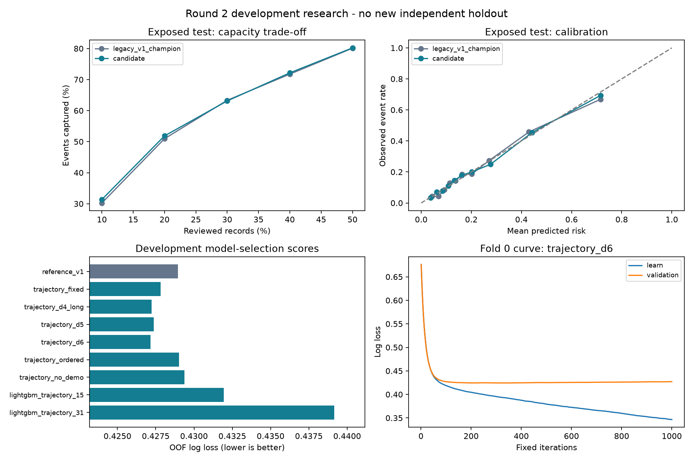

# ผลวิจัยและ failure analysis รอบสอง

วันที่ 4 ตุลาคม 2026 — `experiment_v2` — งานวิจัยที่ไม่ใช่เชิงพาณิชย์

## ผลที่ควรเข้าใจก่อน

เกณฑ์ยอมรับ development pipeline: **ผ่าน**; pipeline ที่บันทึกเพื่อใช้งานวิจัยคือ `blend`

เลือก CatBoost `trajectory_d6` และ LightGBM `lightgbm_trajectory_15` จาก group OOF แล้วค้นน้ำหนักบนกริด 5 ค่า ได้ CatBoost weight **0.75** ลด OOF log loss จาก 0.428955 เป็น 0.427110 ต่าง -0.001845; fold deltas = -0.002016, -0.002490, -0.001030

บน test เดิม Candidate AUC ต่างจาก V1 เดิม +0.000857, log loss ต่าง -0.002126 **test ชุดนี้เปิดแล้วและใช้ failure analysis ก่อนออกแบบรอบสอง จึงเป็น retrospective reference ไม่ใช่หลักฐานยืนยันใหม่** คะแนน OOF ของผู้ชนะก็เป็น model-selection score; ไม่เรียก unbiased estimate หรือ SOTA

## 1. โมเดลเดิมพลาดอย่างไร

test เดิมมี 4,500 แถว ผู้ผิดนัดตาม dataset label 995 ราย (22.11%) คำว่า events ในรายงานหมายถึง label นี้ ไม่ใช่การรับรอง 90+ DPD หรือ regulatory 12-month PD

| จุดตัด V1 | จับผู้ผิดนัด | พลาดผู้ผิดนัด | non-events ที่ถูกส่งตรวจ | Recall | Precision | สัดส่วนส่งตรวจ |
| --- | --- | --- | --- | --- | --- | --- |
| 0.5 | 358 | 637 | 194 | 35.98% | 64.86% | 12.27% |
| 0.2043 (เลือกจาก validation) | 675 | 320 | 870 | 67.84% | 43.69% | 34.33% |

ที่ threshold 0.5 จับผู้ผิดนัดได้ 358 รายและพลาด 637 ราย จุดตัดที่เลือกจาก validation ให้ recall อย่างน้อย 70% ช่วยจับได้ 675 รายใน test แต่ส่ง non-events เพิ่มจาก 194 เป็น 870 ราย นี่เป็น **การเปลี่ยนภาระการตรวจ** ไม่ใช่การเพิ่ม AUC หรือเปลี่ยนโมเดล ต้องมี cost/capacity จริงก่อนเลือก policy และคำว่า flagged ไม่ใช่คำสั่งปฏิเสธสินเชื่อ

กลุ่มที่ไม่มี positive repayment code มี 2,968 แถว, events 349, พลาดที่ threshold 0.5 จำนวน 348; mean prediction 12.10% เทียบ observed rate 11.76% ตัวเลขนี้ยังไม่ชี้ systematic underprediction ทั้งกลุ่ม การแบ่งอันดับภายในกลุ่มอาจต้องการ signal เพิ่ม แต่ยังไม่รู้ว่าข้อมูลเดิมมี signal เพียงพอหรือไม่

เคส 10% ที่ individual log loss สูงสุดคิดเป็น 44.83% ของ loss ทั้งหมด เป็นจุดเน้นการวิเคราะห์ โดยไม่ได้ oversample เคสเหล่านี้ในการฝึก และไม่สมมติว่าความมั่นใจผิดเกิดจาก label error

exact-vector conflicting labels พบ 21 กลุ่ม รวม 46 แถว; predictor เดียวกันจึงแยก label เหล่านี้ไม่ได้ด้วย deterministic model ของ features เดิม แต่เป็นจำนวนน้อย ไม่ใช่คำอธิบายข้อผิดพลาดทั้งหมด ไม่ลบ/แก้ label และไม่ตีความเป็น population Bayes-error floor

หลักฐาน baseline อยู่ใน `../failure_analysis_v1/`: summary, slices, calibration bins, capacity, complementarity และ largest losses รายการ slices ซ้อนทับกัน ห้ามรวม loss shares ข้าม slices

## 2. สมมติฐานที่ทดลองและตัวแปรที่ควบคุม

- เก็บ 23 predictors เดิมและ unknown codes เป็น nominal โดยไม่เดาความหมาย
- Feature group ใหม่: จำนวน/ระดับของ positive delay codes, recent-versus-prior summaries, monthly bill/limit และ payment/limit, zero-payment counts, signed bill/payment variation และ monthly slopes
- ไม่จับคู่บิลกับ payment แล้วเรียก “จ่ายเต็ม/ขั้นต่ำ” เพราะไม่มีหลักฐานพอของ bill settlement alignment; aggregate ratios เป็น numeric summaries
- `trajectory_fixed` เทียบ reference โดยคง settings เดิม จึงตรวจผลรวมของ feature group ได้ ส่วน candidate อื่นเปลี่ยนหลาย settings ไม่ใช้พิสูจน์เหตุของ parameter เดี่ยว
- `trajectory_no_demo` ใช้ settings เดียวกับ `trajectory_d4_long` และตัด SEX/EDUCATION/MARRIAGE/AGE เป็น sensitivity analysis ไม่ใช่ proof of fairness
- ไม่ SMOTE/class-weight หรือปรับ threshold เพื่อแสร้งว่า ranking/probability ดีขึ้น

| Candidate | Setting |
| --- | --- |
| reference_v1 | {'depth': 4, 'iterations': 600, 'learning_rate': 0.05, 'l2_leaf_reg': 5} |
| trajectory_fixed | {'depth': 4, 'iterations': 600, 'learning_rate': 0.05, 'l2_leaf_reg': 5} |
| trajectory_d4_long | {'depth': 4, 'iterations': 1200, 'learning_rate': 0.03, 'l2_leaf_reg': 10} |
| trajectory_d5 | {'depth': 5, 'iterations': 1000, 'learning_rate': 0.03, 'l2_leaf_reg': 10} |
| trajectory_d6 | {'depth': 6, 'iterations': 1000, 'learning_rate': 0.03, 'l2_leaf_reg': 20} |
| trajectory_ordered | {'depth': 4, 'iterations': 800, 'learning_rate': 0.04, 'l2_leaf_reg': 10, 'boosting_type': 'Ordered'} |
| trajectory_no_demo | {'depth': 4, 'iterations': 1200, 'learning_rate': 0.03, 'l2_leaf_reg': 10} |
| lightgbm_trajectory_15 | {'num_leaves': 15, 'n_estimators': 700, 'learning_rate': 0.025, 'min_child_samples': 100, 'reg_lambda': 10.0, 'colsample_bytree': 0.9} |
| lightgbm_trajectory_31 | {'num_leaves': 31, 'n_estimators': 700, 'learning_rate': 0.025, 'min_child_samples': 100, 'reg_lambda': 10.0, 'colsample_bytree': 0.9} |

Original fit 16,500 แถว แบ่ง 3 group folds แต่ละ fold ไม่มีกลุ่ม exact-vector ข้าม fit/holdout ใช้ seed 20261005 ทุก candidates, 2 concurrent jobs และ 2 threads ต่อ base model ไม่มี early stopping บน outer holdout; เก็บ learning curves เพื่อวิเคราะห์หลังจบ ไม่ปรับกริดตาม curves รอบนี้

Reference recipe ใน CV ใช้ settings ของ V1 แต่ seed รอบสอง จึงไม่ใช่น้ำหนักเดิมของ V1 การเทียบ old test แสดงทั้ง legacy V1 artifact และ CV-reference refit แยกกัน

## 3. ผล model selection บน group OOF

| Candidate | Features | OOF AUC ↑ | OOF AP ↑ | OOF log loss ↓ | OOF Brier ↓ |
| --- | --- | --- | --- | --- | --- |
| trajectory_d6 | 68 | 0.784891 | 0.552965 | 0.427165 | 0.134288 |
| trajectory_d4_long | 68 | 0.784298 | 0.553697 | 0.427231 | 0.134207 |
| trajectory_d5 | 68 | 0.783797 | 0.553921 | 0.427362 | 0.134194 |
| trajectory_fixed | 68 | 0.783478 | 0.553365 | 0.427815 | 0.134395 |
| reference_v1 | 37 | 0.781785 | 0.549919 | 0.428955 | 0.134713 |
| trajectory_ordered | 68 | 0.781459 | 0.550659 | 0.429028 | 0.134740 |
| trajectory_no_demo | 64 | 0.781046 | 0.552532 | 0.429365 | 0.134945 |
| lightgbm_trajectory_15 | 68 | 0.779762 | 0.544549 | 0.431943 | 0.135830 |
| lightgbm_trajectory_31 | 68 | 0.774513 | 0.539225 | 0.439166 | 0.137640 |

Blend ที่เลือก: AUC 0.784847, AP 0.553305, log loss 0.427110, Brier 0.134286

เกณฑ์ผ่านที่ล็อกไว้: ลด OOF log loss อย่างน้อย 0.001, ดีขึ้นทุก fold และ Brier ไม่แย่ลง ไม่ใช่นัยสำคัญทางสถิติหรือ business utility เงื่อนไขนี้เป็นของรอบทดลองนี้เท่านั้น เก็บ candidates ทั้งหมด ไม่มีการเพิ่มหลังเห็นผล

## 4. เปรียบเทียบ reference ที่เปิดแล้วหลังล็อก selection

Final fit ใช้ 16,500 แถวเท่าเดิม; เลือก identity/sigmoid/isotonic ด้วย group OOF ภายใน calibration 4,500 แถวที่เคยใช้แล้ว ไม่เรียก partition นี้ independent pipeline-selection holdout

| โมเดลบน exposed test | AUC ↑ | AP ↑ | Log loss ↓ | Brier ↓ |
| --- | --- | --- | --- | --- |
| V1 เดิม: CatBoost behavior | 0.786076 | 0.542118 | 0.428993 | 0.135413 |
| reference_v1 (identity) | 0.786082 | 0.543020 | 0.428663 | 0.135169 |
| candidate_blend (identity) | 0.786933 | 0.548343 | 0.426866 | 0.134399 |

Candidate เทียบ legacy V1: 95% paired group-bootstrap differences (300 replicates) AUC [-0.003690, +0.005365], log loss [-0.005146, +0.001076]

บน selected OOF: log-loss difference interval [-0.003481, -0.000517]

Intervals เป็น descriptive conditional-on-selection resampling; ไม่ชดเชย adaptive model selection, training dependence ระหว่าง CV folds หรือการเห็น test ก่อน จึงไม่ใช้ประกาศ significance/generalization แม้ interval ไม่คร่อมศูนย์

## 5. ความผิดพลาดกลุ่มเดิมดีขึ้นหรือแย่ลง

| กลุ่มบน exposed test | แถว | events | V1 log loss | Candidate log loss | Δ log loss |
| --- | --- | --- | --- | --- | --- |
| PAY_0=0 | 2228 | 304 | 0.366082 | 0.365140 | -0.000942 |
| PAY_0=1 | 554 | 187 | 0.589675 | 0.582508 | -0.007167 |
| no_positive_pay_code | 2968 | 349 | 0.342959 | 0.342891 | -0.000068 |
| recent_code_ge_2 | 467 | 317 | 0.633752 | 0.627558 | -0.006194 |
| zero_payments_3plus | 872 | 263 | 0.518025 | 0.511210 | -0.006815 |
| utilization_gt_1 | 341 | 107 | 0.560973 | 0.559586 | -0.001387 |

Δ log loss ติดลบหมายถึง probability loss ดีขึ้นใน slice นั้น เป็น exploratory analysis มี slices ซ้อนทับและกลุ่มเล็ก ไม่ใช่ข้อสรุป causal หรือการคัด feature ตาม test รอบใหม่

**สมมติฐานที่ยังไม่สำเร็จ:** กลุ่มไม่มี positive repayment code มี log loss 0.342959 → 0.342891 แทบไม่เปลี่ยน ขณะที่ AUC 0.675205 → 0.669746 ลดลง พลาดที่ threshold 0.5 จำนวน 348 → 348 ราย การเพิ่ม features/complexity รอบนี้จึงยังไม่แก้การจัดอันดับในกลุ่มปัญหาหลัก ไม่อ้างว่าสาเหตุคือ label noise หรือไม่มี signal โดยไม่มีหลักฐานเพิ่ม

| Capacity บน exposed test | V1 events captured | Candidate events captured | V1 recall | Candidate recall |
| --- | --- | --- | --- | --- |
| 10% | 301 | 312 | 30.25% | 31.36% |
| 20% | 507 | 516 | 50.95% | 51.86% |
| 30% | 630 | 628 | 63.32% | 63.12% |
| 40% | 714 | 718 | 71.76% | 72.16% |
| 50% | 797 | 798 | 80.10% | 80.20% |

Capacity เป็นการจัดอันดับแล้วส่งเคสสูงสุดตามจำนวนที่กำหนด ช่วยเทียบภายใต้ workload เท่ากัน ไม่ fit threshold ใหม่จาก test และไม่ประเมินกำไร/expected monetary loss เพราะขาดต้นทุน, LGD และ EAD



| CV fold ของ selected CatBoost | fixed iterations | minimum iteration (posthoc) | minimum heldout loss | final heldout loss | train final loss |
| --- | --- | --- | --- | --- | --- |
| 0 | 1000 | 353 | 0.424372 | 0.427132 | 0.346616 |
| 1 | 1000 | 727 | 0.416346 | 0.416972 | 0.353025 |
| 2 | 1000 | 243 | 0.434504 | 0.437389 | 0.346441 |

Learning curves ของ selected CatBoost แสดง train loss ลดลงต่อ แต่ heldout loss มีจุดต่ำสุดก่อนครบ fixed iterations การดูจุดต่ำสุดนี้เป็น **posthoc diagnosis เท่านั้น** ไม่ refit ตาม outer fold minima เพราะจะเปลี่ยน heldout labels ให้เป็น tuning data ขั้นต่อไปจึงควรทดสอบ inner-fold early stopping ใน protocol ใหม่ ดู `learning_curve_diagnostics.csv` และ `failure_followup.json`

## 6. เพิ่ม context ของ TabPFN-3.5 ได้ผลหรือไม่

context 4,000 รวม 1,000 แถวเดิมไว้ข้างใน ใช้ validation 400/calibration 600/test 4,500 แถวเดิม, 2 estimators และ local CPU; ทั้ง TabPFN และ matched CatBoost ได้ context เดียวกัน ไม่มีการเลือกจาก test

| Auxiliary model | Fit/context | AUC ↑ | AP ↑ | Log loss ↓ | Brier ↓ |
| --- | --- | --- | --- | --- | --- |
| aux_catboost_1000 | 1000 | 0.755604 | 0.495981 | 0.448645 | 0.141974 |
| aux_tabpfn_v3.5 | 1000 | 0.772835 | 0.525400 | 0.434855 | 0.136513 |
| tabpfn_3_5_4000 | 4000 | 0.781629 | 0.536987 | 0.432689 | 0.136405 |
| catboost_4000 | 4000 | 0.766467 | 0.517758 | 0.442382 | 0.139899 |

| Auxiliary model | fit/preprocessing/calibration วินาที | test batch วินาที |
| --- | --- | --- |
| tabpfn_3_5_4000 | 262.92 | 970.49 |
| catboost_4000 | 78.25 | 0.07 |

TabPFN auxiliary shell session คืน exit 1 พร้อม PowerShell `NativeCommandError` แต่ stderr มี CPU-speed UserWarning และทั้งสอง trials จบพร้อม predictions/result files จริง ตรวจซ้ำจาก CSV ว่า IDs/probability/metrics ตรงกันแล้ว ทดสอบพฤติกรรม shell ด้วย warning-only probe พบ child Python exit 0 แต่ direct redirection session exit 1 เช่นกัน หลักฐานอยู่ใน `outputs/diagnostics/powershell_warning_behavior.json` จึงแยก shell warning status ออกจาก model-trial success ไม่ลบ warning หรือ rerun ผลเดิมเพื่อเปลี่ยนสถานะ

ห้ามเทียบอันดับ 1,000/4,000/16,500 แถวเป็นการแข่งขนาดข้อมูลเท่ากัน และเวลามี CPU contention ระหว่าง jobs ไม่ใช่ speed benchmark ที่ควบคุมเครื่องว่าง การ `fit` ของ TabPFN คือ context/preprocessing ไม่ใช่การฝึกน้ำหนัก foundation model ใหม่

## 7. ตรวจอะไรแล้วและใช้ต่ออย่างไร

`analysis.json` บันทึก checks: hashes ของ V1/data/features ไม่เปลี่ยน, OOF ทั้งเก้าใช้ IDs เดียวกัน/probability finite, CV groups disjoint, ID/target ไม่กระทบ engineered features, single-row/batch feature parity, demographic ablation ตัดครบ และ reload/scoring parity ของ pipeline ผ่าน

```powershell
.venv\Scripts\python.exe scripts\score_v2.py outputs\experiment_v2\demo_input.csv
```

รับ 23 predictors ไม่มี ID/target ให้ probability ของ dataset label สำหรับการทดลอง ไม่มี lending decision โมเดลเดิม V1 และผลเดิมเก็บครบ; V2 bundle อยู่ใน `models/pipeline.joblib`

Aggregate feature influence อยู่ใน `catboost_feature_importance.csv` เป็น PredictionValuesChange ของ CatBoost component ไม่ใช่ causal importance หรือคำอธิบาย probability ของ ensemble ที่ผ่าน calibration แล้ว

## 8. ขั้นต่อไปที่มีหลักฐานรองรับ

1. ล็อก V2 recipe ก่อนรับข้อมูลใหม่ ประเมินบน cohort ใหม่/ช่วงเวลาถัดไปที่ labels mature แล้ว ต้องนิยาม default/horizon และ feature availability ให้ชัด; random re-split ของข้อมูลเดิมไม่แก้ปัญหา test reuse
2. สำหรับกลุ่มที่ไม่มี positive code ตรวจข้อมูลพอร์ตจริงว่ามี income/cash flow, utilization/exposure history, account tenure หรือ bureau history ณ เวลาตัดสินใจหรือไม่ เป็น hypotheses ที่ต้องทดสอบ ไม่ใช่การรับรองว่าช่วยแน่
3. หากต้องการความเที่ยงของ model-selection procedure ภายใน cohort ใช้ nested group CV ที่เลือกทุก setting ภายใน inner folds และเพิ่ม folds/repeatsตาม compute budget; ยังไม่แทน temporal/Thai-bank validation
4. ทดลองลด engineered feature redundancy และแยก ablation ของ parameter เดี่ยวใน protocol ใหม่ ไม่ย้อนแก้ settings ของรอบนี้ให้เข้ากับ test
5. กำหนด review capacity และ costs ก่อนเลือก threshold; ทดสอบ subgroup/error stability และคำอธิบายของ final calibrated pipeline ก่อนใช้ operationally

แนวทางวิจัย/primary-source audit และข้อเสนอ agy ที่รับหรือไม่รับอยู่ใน [research approach](../../research/ITERATION_2_APPROACH_TH.md) agent รีวิว supplied methodology ไม่ได้คำนวณตารางนี้ ไม่มีการเรียก Gemini CLI
