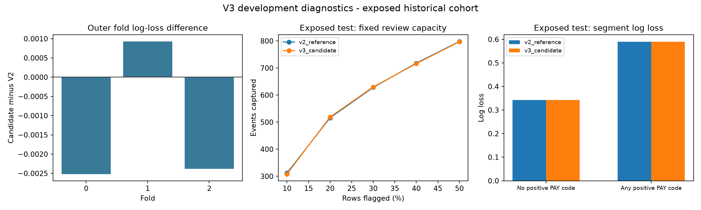

# ผลวิจัย credit-default รอบสาม และ failure analysis

5 ตุลาคม 2026 — non-commercial research — Taiwan 2005 UCI/Kaggle cohort เดิม

**ผลการตัดสินใจ: คง V2; candidate รอบสามไม่ผ่าน gate ที่ล็อกก่อนรัน**

รอบนี้ปรับวิธีเลือกความลึก/จำนวนต้นไม้ให้ใช้ inner group folds ก่อน refit outer train ทั้งชุด โดยไม่มี outer eval_set แยก schema, features, calibration, model adapters และ scoring เป็น package ที่ตรวจด้วย tests ได้ ไม่เปลี่ยนข้อมูลเดิมหรือ feature values เพื่อให้คะแนนดูดีขึ้น

## ผล OOF บน original fit 16,500 แถว

| กระบวนการ | ROC-AUC ↑ | AP ↑ | Log loss ↓ | Brier ↓ |
|---|---:|---:|---:|---:|
| V2 frozen blend | 0.784847 | 0.553305 | 0.427110 | 0.134286 |
| V3 nested candidate | 0.785682 | 0.557387 | 0.425785 | 0.133691 |

Pooled log-loss gain = 0.001325090; เปรียบเทียบแบบจับคู่บนแถว/folds เดิม มี historical model/feature selection จึงไม่ใช่คะแนนยืนยันจากข้อมูลใหม่

| Outer fold | Inner-selected depth | Refit trees | Candidate log loss | Candidate − V2 log loss |
|---|---:|---:|---:|---:|
| 0 | 6 | 366 | 0.424773 | -0.002520 |
| 1 | 6 | 208 | 0.418056 | +0.000928 |
| 2 | 6 | 329 | 0.434524 | -0.002383 |

| Gate ที่กำหนดล่วงหน้าสำหรับรอบนี้ | ผล |
|---|---|
| Log-loss gain ≥ .001 | PASS |
| Log loss ดีขึ้นทุก outer fold | FAIL |
| Pooled Brier ไม่แย่ลง | PASS |
| Quiet-segment log loss เพิ่มไม่เกิน .001 | PASS |

คะแนน pooled ดีขึ้นยังไม่พอสำหรับเปลี่ยนโมเดลตามเกณฑ์นี้ หากหนึ่งเงื่อนไขไม่ผ่านให้คง V2 ไม่เปลี่ยน gate หรือเพิ่ม candidates หลังเห็นผล การบังคับทุก fold เป็น development criterion ที่เลือกไว้ ไม่ใช่ statistical significance test

## Old validation/test หลังล็อก gate: ใช้เชิงพรรณนาเท่านั้น

| Pipeline | Partition | Calibration | AUC | AP | Log loss | Brier |
|---|---|---|---:|---:|---:|---:|
| v2_reference | exposed_validation | identity | 0.801502 | 0.599031 | 0.411879 | 0.128087 |
| v2_reference | exposed_test | identity | 0.786933 | 0.548343 | 0.426866 | 0.134399 |
| v3_candidate | exposed_validation | identity | 0.803643 | 0.601619 | 0.410785 | 0.127800 |
| v3_candidate | exposed_test | identity | 0.788159 | 0.547486 | 0.426297 | 0.134255 |

Final nested candidate เลือก depth 6, 257 trees จาก inner procedure บน fit 16,500 ใหม่ ไม่ดึง depth/trees จาก outer scores มาเลือก การเลือก calibrator ใช้ group folds ใน calibration 4,500 เดิม และทั้งสอง pipeline ประเมิน references หลัง gate ล็อกแล้ว

แม้คะแนน old test จะดีขึ้นก็ไม่ใช้เปลี่ยนคำตัดสินหรือจูนต่อ; old test เคยใช้ในงานเดิม จึงไม่ใช่ independent holdout การ split ใหม่จากแถวเดิมไม่แก้ข้อจำกัดนี้

## Failure analysis: สัญญาณใดดีขึ้น และสิ่งใดยังไม่แก้

| Partition / slice | Rows / events | V2 LL | V3 LL | V2 AUC | V3 AUC | V2 FN@.5 | V3 FN@.5 |
|---|---:|---:|---:|---:|---:|---:|---:|
| development_oof/no_positive_pay_code | 11024/1304 | 0.344945 | 0.344961 | 0.667189 | 0.665937 | 1302 | 1304 |
| development_oof/any_positive_pay_code | 5476/2345 | 0.592520 | 0.588495 | 0.741978 | 0.745360 | 1001 | 1017 |
| development_oof/quiet_zero_payments_3plus | 1546/285 | 0.459887 | 0.459155 | 0.633628 | 0.638245 | 283 | 285 |
| development_oof/quiet_zero_payments_under3 | 9478/1019 | 0.326196 | 0.326334 | 0.660212 | 0.658593 | 1019 | 1019 |
| exposed_test/no_positive_pay_code | 2968/349 | 0.342891 | 0.342114 | 0.669746 | 0.675451 | 348 | 349 |
| exposed_test/any_positive_pay_code | 1532/646 | 0.589555 | 0.589388 | 0.743720 | 0.743472 | 280 | 284 |
| exposed_test/quiet_zero_payments_3plus | 426/69 | 0.430301 | 0.429798 | 0.625705 | 0.621240 | 68 | 69 |
| exposed_test/quiet_zero_payments_under3 | 2542/280 | 0.328243 | 0.327420 | 0.673200 | 0.681453 | 280 | 280 |

Quiet group บน old test มี 2968 แถว/349 events; V2 mean probability 0.1171, V3 0.1185, observed rate 0.1176 ให้ดูแยกจาก recall@.5 ซึ่งขึ้นกับ threshold มาก ทั้งสองตัวเลขไม่บอกสาเหตุของ default

การใช้ threshold .5 ในกลุ่มที่มี event rate ประมาณ .12 ทำให้เกิด FN จำนวนมากตามคะแนนที่วัด แต่ไม่ใช่ข้อกำหนดการปล่อยสินเชื่อ การลด threshold เปลี่ยนจำนวนที่ส่งตรวจและ FP/FN ไม่ได้ทำให้ AUC/log loss ของโมเดลดีขึ้นโดยตัวมันเอง ต้องมีต้นทุน/ความสามารถตรวจเคสที่ทราบก่อนออก policy

OOF quiet-group log-loss delta = +0.000015939 จึงยังไม่เห็นการแก้ปัญหานี้อย่างมีสาระจากการเปลี่ยนวิธีเลือกต้นไม้เพียงอย่างเดียว ภายในกลุ่มมีความต่างของ zero-payment/bill/code histories จาก EDA จริง แต่ features เดิมมีสรุปเหล่านี้แล้ว การทดลองนี้ไม่ได้เพิ่มสัญญาณใหม่

**สมมติฐานที่ยังไม่พิสูจน์:** จำนวนต้นไม้ที่เลือกจาก inner training ขนาดประมาณ 7,333 แถวอาจเหมาะต่างจาก outer refit ประมาณ 11,000 แถว; median-tree rule ไม่รับประกัน optimum ของขนาดใหม่ ความแปรปรวนของการเลือกและ fixed blend อาจอธิบาย fold ที่แย่ลงได้ แต่ยังไม่ใช่ causal attribution ห้ามจูน iteration multiplier ย้อนหลังให้ fold นี้ดีขึ้นแล้วอ้างเป็น independent improvement

ยังไม่มีข้อมูลรายได้ ภาระหนี้นอกบัญชี หรือเหตุการณ์ใหม่ที่วัดใน CSV นี้ ไม่อ้างว่าปัจจัยใดทำให้ทำนายพลาด และ exact-vector label conflicts ไม่ใช่หลักฐานให้แก้/ลบ labels

## Review capacity บน old test

| จำนวนแถวที่เลือกตรวจ | V2 captured events | V3 captured events |
|---|---:|---:|
| 10% | 312 | 308 |
| 20% | 516 | 519 |
| 30% | 628 | 630 |
| 40% | 718 | 716 |
| 50% | 798 | 797 |

ใช้ fixed top-N และ stable tie ordering เพื่อเปรียบเทียบเท่านั้น ไม่เลือก capacity ที่ดูดีที่สุดจาก old test ไปกำหนด business policy

## Uncertainty และข้อจำกัด

300 paired exact-vector group bootstrap replicates จาก probabilities ที่ตรึงแล้ว; ต่อไปนี้เป็น candidate − V2, conditional descriptive percentile intervals ไม่รวม adaptive selection/training variance หรือความทับซ้อนของ CV training sets และไม่อ้าง formal coverage

| Partition | AUC difference interval | Log-loss difference interval | Brier difference interval |
|---|---|---|---|
| development_oof | [-0.000487, +0.002080] | [-0.002166, -0.000499] | [-0.000875, -0.000285] |
| exposed_validation | [-0.000074, +0.004455] | [-0.002804, +0.000524] | [-0.000845, +0.000286] |
| exposed_test | [-0.001168, +0.003573] | [-0.002313, +0.001156] | [-0.000744, +0.000472] |

Nested inner selection แก้ขอบเขตการ fit ของรอบนี้ แต่ไม่ลบประวัติที่เลือก data/features/architecture จาก cohort นี้ ต้อง freeze pipeline ก่อนเปิด labeled cohort ใหม่ซึ่งตรง target/population และแยกเวลา/borrower จึงจะอ้าง independent validation ได้

## Clean code และหลักฐานตรวจ

- `src/creditrisk` แยกหน้าที่และใช้ CLI `credit-risk`/`python -m creditrisk.cli`; input schema และ probability checks ชัดเจน ไม่อาศัยตัวแปร global ของ legacy experiment ใน inference
- feature migration ตรงกับ V2 ทุกเซลล์ของจริง 30,000 แถว (37/68/64 columns ตาม variant) และไม่ขึ้นกับ ID/target
- clean V2 refit ได้ metrics ตรงเดิม และเปรียบเทียบ probability ทุกแถวกับ local historical V2 artifacts ตาม `verification.json`
- saved model ตรงผล reference ที่ gate เลือก; single/batch/nonunique-index/reload parity ผ่าน; group/hash/ID/order/metric checks ผ่าน
- unit tests รวม real small CatBoost model ปกป้อง boundaries/invalid inputs/unknown categories/zero denominators ไม่ใช้ raw downloaded data หรือ token; Ruff lint/format และ compile checks ใช้กับ maintained code
- historical V1/V2 scripts/outputs คงหลักฐานเดิม และ Git attributes รักษา byte hashes ของ historical scripts/public evidence; raw data/models/.env/local agent logs ถูก ignore
- native agy method/code review เป็น supplied-material review; primary researcher ตรวจข้ออ้างและข้อแก้จริง ไม่ใช้คำเสนอของ agent แทน measurements ไม่มี Gemini CLI

CLI preflight ครั้งแรกพบ dispatch `cv`/`run_cv` ไม่ตรงกันก่อนเริ่ม model fit แก้ entry point เพิ่ม regression test และเก็บ unused protocol/failure record ใน `outputs/experiment_v3/preflight_failed` แล้ว freeze corrected protocolก่อน training ไม่มีผลลัพธ์ถูกใช้เปลี่ยน grid/gate

## ทำซ้ำและใช้ pipeline ที่ผ่านการเลือก

```powershell
uv pip install --python .venv\Scripts\python.exe -r requirements-core.txt -r requirements-dev.txt -e .
.venv\Scripts\python.exe scripts/fetch_data.py
.venv\Scripts\python.exe tools/verify_input_sources.py
.venv\Scripts\python.exe tools/verify_feature_migration.py
.venv\Scripts\python.exe -m creditrisk.cli prepare
.venv\Scripts\python.exe -m creditrisk.cli cv
.venv\Scripts\python.exe -m creditrisk.cli select
.venv\Scripts\python.exe -m creditrisk.cli finalize
.venv\Scripts\python.exe tools/analyze_v3.py
.venv\Scripts\python.exe tools/build_v3_report.py
```

ใช้ workspace/output ใหม่สำหรับ rerun ไม่เขียนทับ completed artifacts; full legacy/TabPFN environment เก็บใน `requirements.lock.txt` แยกจาก core experiment ไม่ต้องมี TabPFN key สำหรับรอบนี้



ดู [literature review และ data exploration](../../research/ITERATION_3_RESEARCH_TH.md), [protocol](protocol.json), [selection](selection.json), [verification](verification.json), [AGY review disposition](../../research/AGY_V3_REVIEW_DISPOSITION_TH.md)

Dataset: I-Cheng Yeh (2009), [UCI Default of Credit Card Clients](https://archive.ics.uci.edu/dataset/350/default+of+credit+card+clients), [DOI 10.24432/C55S3H](https://doi.org/10.24432/C55S3H), CC BY 4.0; mirror Kaggle เทียบต้นฉบับตรงทุกเซลล์ นิยาม default แบบ regulatory ยังไม่ยืนยัน ไม่มี Thai-bank/OOT/rejected-applicant validation ไม่ใช่ production lending model
