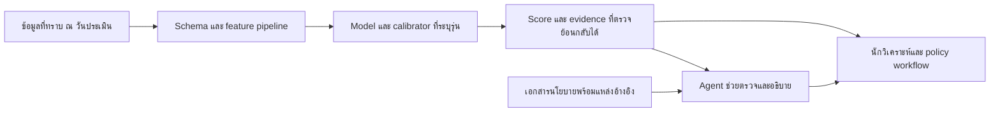

# แนวทางสร้างโมเดล credit risk ที่มีหลักฐานรองรับ

วันที่ตรวจแหล่งข้อมูล: 4 ตุลาคม 2026

> เอกสารนี้เป็นข้อเสนอก่อนฝึกโมเดล ตัวเลขและสถานะหลังทดลองจริงอยู่ใน [รายงาน experiment_v1](../reports/v1/REPORT_TH.md) ไม่ใช้ข้อความ “ยังไม่ได้ฝึก” ด้านล่างเป็นสถานะปัจจุบัน

## ข้อเสนอที่นำไปใช้ตัดสินใจได้

**เลือกกระบวนการเปรียบเทียบที่เชื่อถือได้ก่อนเลือกชื่อโมเดล** สำหรับต้นแบบที่เริ่มจากข้อมูลตาราง แนะนำให้เริ่มทำ baseline ด้วย Logistic Regression และทดลอง CatBoost หรือ LightGBM ที่ปรับเทียบความน่าจะเป็นแล้ว พร้อม EBM เป็นตัวเปรียบเทียบที่อ่านความสัมพันธ์ได้ และ TabPFN-3.5 เป็นตัวเปรียบเทียบด้านความแม่นยำตามหลักฐานล่าสุด ไม่มีผลทดลองของโครงการนี้ที่จะระบุผู้ชนะแล้ว

ถ้าต้องจัดลำดับการลงมือทำ: Logistic baseline → CatBoost และ LightGBM → EBM → TabPFN-3.5 ภายใต้สิทธิ์ใช้โมเดลและทรัพยากรที่เหมาะสม ลำดับนี้เป็นข้อเสนอทางวิศวกรรมเพื่อให้ได้ผลที่ตรวจสอบได้เร็ว ไม่ใช่ลำดับความแม่นยำที่พิสูจน์แล้ว

ข้อมูล UCI ที่เสนอเริ่มต้นเป็น **behavioral benchmark** สำหรับลูกหนี้บัตรเครดิตเดิม หากโจทย์จริงคือการพิจารณาผู้สมัครสินเชื่อใหม่หรือ SME ต้องเปลี่ยน data contract และคัดข้อมูลใหม่ก่อนนำผลไปตีความ

## 1. ต้องกำหนดโจทย์ให้แคบและตรงกับข้อมูล

Credit risk ครอบคลุมหลายปัญหา แบ่งงานแรกได้ดังนี้:

| งาน | หน่วยที่ทำนาย | ข้อมูลที่ต้องมี ณ เวลาทำนาย | ผลลัพธ์ |
|---|---|---|---|
| Application scoring | ผู้สมัคร/ใบสมัคร | ข้อมูลที่ทราบก่อนอนุมัติ รวมข้อมูลเครดิตที่เข้าถึงได้ในเวลานั้น | โอกาสเกิดเหตุการณ์ผิดนัดภายใน horizon ที่กำหนด |
| Behavioral scoring | ลูกหนี้เดิม ณ วันประเมิน | ประวัติชำระ บิล วงเงิน และข้อมูลล่าสุดที่ระบบได้รับแล้ว | โอกาสผิดนัดในช่วงถัดไป |
| SME/corporate rating | บริษัท/ผู้กู้ | งบการเงิน กระแสเงินสด อุตสาหกรรม ภาระหนี้ และปัจจัยเชิงคุณภาพ | ระดับเครดิต/PD ตามนิยามของพอร์ต |
| Loss estimation | สัญญา/พอร์ต | การผิดนัด การกู้คืน exposure และเงื่อนไขสัญญา | LGD, EAD และ loss ที่สอดคล้องกับวัตถุประสงค์ |

Data contract ต้องระบุ population, product, prediction date, event definition, horizon, unit of analysis และเวลาที่ label ทราบจริง ตัวอย่างโจทย์ที่จะเสนอให้ตกลงคือ “ใช้ข้อมูลที่มีถึงวันประเมิน เพื่อทำนายเหตุการณ์ผิดนัดภายในช่วงเวลาที่กำหนด” ระยะเวลาและนิยามผิดนัดต้องมาจากข้อมูลและนโยบายของงาน ไม่เติมเอง

Fraud detection มี event, feature availability และ latency ของตัวเอง ผล fraud score อาจเป็นข้อมูลประกอบในอนาคต แต่ต้องพิสูจน์ว่าเกิดก่อนเวลาประเมินเครดิตและเพิ่มประโยชน์จริง ไม่ใช้ target ของ fraud แทน target ของ credit risk

## 2. เอกสาร ธปท. บอกอะไร และไม่ได้บอกอะไร

คู่มือที่ผู้ใช้ให้ปรับปรุงเดือนธันวาคม 2567 ระบุให้เลือกเครื่องมือให้สอดคล้องกับสินเชื่อ ใช้ข้อมูลที่น่าเชื่อถือ ทดสอบแบบจำลอง และเข้าใจข้อจำกัด โดยกล่าวถึง obligor rating ที่สะท้อน PD ใน 12 เดือนข้างหน้า ตลอดจนการเตรียมข้อมูล การสร้าง scoring การทดสอบ และการติดตาม คู่มือยังแยก PD, LGD, EAD และ maturity ในบริบท IRB ดูหน้า PDF 16–19 (เลขพิมพ์ในเอกสาร 15–18) [คู่มือ ธปท.](https://www.bot.or.th/content/dam/bot/documents/th/our-services/Member-corner/manual-of-supervision/Credit-risk-framwork-2567-attachment.PDF)

ข้อสรุปสำหรับโครงการนี้: คู่มือเป็นกรอบกำกับกระบวนการ ไม่ใช่หลักฐานว่าอัลกอริทึมใดแม่นที่สุด และไม่ทำให้ target ของ Kaggle กลายเป็น regulatory PD โดยอัตโนมัติ รายงานนี้ไม่ได้รับรองการปฏิบัติตามกฎทั้งหมดที่มีผล ณ วันที่นำระบบไปใช้

โมเดลหนึ่งที่ให้ probability ของ label ชุดข้อมูลยังไม่ใช่ระบบ ECL ที่ครบถ้วน กรอบ accounting loss ต้องพิจารณาความเสี่ยงและข้อมูลประกอบตามบริบทของการใช้งาน ดู [BCBS guidance on credit risk and ECL](https://www.bis.org/bcbs/publ/d350.htm) ในต้นแบบอาจใช้ `PD × LGD × EAD` เป็นภาพอธิบาย expected loss อย่างง่าย แต่ต้องระบุว่าเป็นการย่อแนวคิด ไม่ใช่สูตรคำนวณ IFRS 9/TFRS 9 ที่ครบทุก horizon, scenario และการคิดลด

## 3. Literature review: หลักฐานที่เปลี่ยนวิธีเลือกโมเดล

นี่เป็น targeted literature review สำหรับการตัดสินใจเริ่มโครงการ ไม่ใช่ systematic review ที่อ้างว่าค้นงานทั้งหมดครบถ้วน รายงานใช้ข้อค้นพบที่ตรวจจากบทคัดย่อ/ตัวบท/เอกสารผู้พัฒนาที่ระบุ ไม่ถ่ายทอดคะแนนข้าม dataset มาเป็นคะแนนคาดหวังของเรา

| แหล่งหลัก | สิ่งที่แหล่งรายงาน | ผลต่อการออกแบบของเรา | ขอบเขตของหลักฐาน |
|---|---|---|---|
| Lessmann et al., 2015, EJOR | เปรียบเทียบ 41 classifiers บน 8 credit scoring datasets และประเมินหลายมิติ | เปรียบเทียบหลายโมเดลและดูผลทางการเงินประกอบ | benchmark เก่า ไม่พิสูจน์ผู้ชนะในข้อมูลไทย/ปี 2026; DOI landing page เปิดไม่ได้ในครั้งนี้ |
| Grinsztajn et al., NeurIPS 2022 | tree models แข็งแรงบนชุด tabular ขนาดกลางใน benchmark 45 datasets | GBDT ควรอยู่ใน baseline ที่จริงจัง | ไม่ใช่ข้อพิสูจน์ว่า deep learning ทุกรุ่นแพ้ตลอดไป |
| McElfresh et al., NeurIPS 2023 | เปรียบเทียบ 19 algorithms ใน 176 datasets; หลายกรณี tuning มีผลมากกว่าการเลือก NN หรือ GBDT | กำหนด budget และขั้นตอน tuning ให้เป็นธรรม | เป็น broad tabular benchmark ไม่ใช่การรับรอง credit portfolio ใด |
| Prokhorenkova et al., NeurIPS 2018 | CatBoost เสนอ ordered boosting และวิธี categorical features เพื่อแก้ prediction shift รูปแบบที่ศึกษา | ทดลอง CatBoost เมื่อมี categorical predictors | ไม่แก้ feature หลัง outcome หรือการแบ่งข้อมูลข้ามเวลาผิดให้เรา |
| Niculescu-Mizil & Caruana, ICML 2005 | ศึกษาความบิดเบือนของ probability และเปรียบเทียบ Platt/isotonic | แยกการจัดอันดับความเสี่ยงออกจากการปรับ probability | อ้างไม่ได้ว่า calibrator เดียวดีที่สุดทุกข้อมูล; งานเก่าและ DOI landing page เปิดไม่ได้ |
| Nori et al., 2019, InterpretML | แนะนำ framework และ EBM ที่อธิบายได้จากโครงสร้างโมเดล | ใช้ EBM เปรียบเทียบ trade-off ของ accuracy กับ interpretability | paper เป็น preprint; ความแม่นยำในโครงการเรายังไม่ได้วัด |
| Lundberg & Lee, NIPS 2017 | SHAP ให้ feature attribution สำหรับ prediction | อธิบายว่าโมเดลใช้ feature ใดและตรวจเหตุผลผิดปกติ | attribution ไม่ยืนยันเหตุและผลหรือรับรองว่าคนแก้ feature แล้ว outcome จะเปลี่ยน |
| Hollmann et al., Nature 2025 | TabPFN รายงานผลเหนือ baseline ใน benchmark ข้อมูลถึง 10,000 samples | ห้ามตัด foundation model ทิ้งด้วยข้อสรุปจากปี 2022 เพียงอย่างเดียว | ตัวเลขขนาดข้อมูลเป็นของรุ่นใน paper นี้ ไม่ใช่เพดานทุกรุ่น |
| Jäger et al., TabPFN-3.5 Technical Report, Sep 2026 | ผู้พัฒนารายงานผลเด่นทั้ง standard และ non-IID benchmarks | ใส่รุ่นปัจจุบันใน challenger ด้าน predictive performance | technical report จากผู้พัฒนา ไม่ใช่ผลทดสอบอิสระบนพอร์ตไทย |
| Fuster et al., Journal of Finance 2022 | ผลของ ML ในตลาด mortgage สหรัฐมีความแตกต่างระหว่างกลุ่มผู้กู้ | ตรวจ calibration/error และผลของ policy แยกกลุ่มด้วย | ไม่ถ่ายทอดข้อค้นพบด้านกลุ่มประชากรสหรัฐมาเป็นข้อสรุปประชากรไทย |

ลิงก์ต้นทาง: [Lessmann accepted manuscript](https://eprints.soton.ac.uk/377196/1/Lessmann_Benchmarking.pdf), [Grinsztajn proceedings](https://papers.neurips.cc/paper_files/paper/2022/hash/0378c7692da36807bdec87ab043cdadc-Abstract-Datasets_and_Benchmarks.html), [McElfresh proceedings](https://proceedings.neurips.cc/paper_files/paper/2023/hash/f06d5ebd4ff40b40dd97e30cee632123-Abstract-Datasets_and_Benchmarks.html), [CatBoost paper](https://proceedings.neurips.cc/paper/2018/hash/14491b756b3a51daac41c24863285549-Abstract.html), [calibration paper](https://www.cs.cornell.edu/~alexn/papers/calibration.icml05.crc.rev3.pdf), [InterpretML paper](https://arxiv.org/abs/1909.09223), [SHAP paper](https://arxiv.org/abs/1705.07874), [TabPFN Nature](https://www.nature.com/articles/s41586-024-08328-6), [TabPFN-3.5 report](https://arxiv.org/abs/2609.17895), [Fuster publisher](https://onlinelibrary.wiley.com/doi/abs/10.1111/jofi.13090)

รายละเอียดการตรวจข้ออ้างและส่วนที่ยังยืนยันไม่ได้อยู่ใน [REFERENCE_AUDIT.md](REFERENCE_AUDIT.md)

## 4. Approach ที่แนะนำ

### 4.1 ทำข้อมูลให้ตรงกับเวลาตัดสินใจก่อน

เก็บทั้ง `event_time` และ `available_at`: เหตุการณ์เกิดก่อนวันทำนายไม่ได้แปลว่าระบบรู้ข้อมูลนั้นแล้ว ตรวจ feature ที่อาจเกิดหลังการอนุมัติ หลังผิดนัด หลังการติดตามหนี้ หรืออาศัยข้อมูลที่ยังไม่เผยแพร่ ณ วันนั้น

ทำ join และ aggregation จาก historical data โดยใช้ cutoff ที่ชัดเจน เก็บเวอร์ชัน data dictionary, feature pipeline และแหล่งข้อมูล เมื่อหลายสัญญาเป็นของลูกค้ารายเดียว ต้องกำหนดการประเมินให้ตรงกับโจทย์: ลูกค้าเดิมอาจมีประวัติข้ามช่วงเวลาได้ ถ้าตัดข้อมูลอนาคตถูกต้อง; งาน generalization สู่ลูกค้าใหม่ต้องมีการทดสอบที่กัน customer overlap เพิ่มเติม

### 4.2 สร้างโมเดลเปรียบเทียบในเงื่อนไขเดียวกัน

| โมเดล | บทบาท | รายละเอียดที่ต้องล็อกก่อนทดลอง |
|---|---|---|
| Regularized Logistic / scorecard | baseline และตัวเลือกที่สื่อสารได้ง่าย | categorical encoding; scaling สำหรับค่าต่อเนื่อง; ถ้าใช้ WOE/binning ให้ fit ใน train fold เท่านั้น |
| CatBoost | ตัวเลือกแรกสำหรับต้นแบบที่มีข้อมูล categorical | กำหนดชนิด feature ตามความหมาย ไม่ใช้เลขหมวดหมู่เป็นจำนวนต่อเนื่องโดยอัตโนมัติ |
| LightGBM | ตัวเลือก GBDT อีกตัว โดยเฉพาะเมื่อต้องประมวลผลข้อมูลมาก | คุม leaf complexity และ early stopping ด้วย validation ที่ถูกต้อง |
| EBM | เปรียบเทียบความแม่นยำกับโมเดลที่อ่าน shape ของความสัมพันธ์ได้ | จำกัด/ตรวจ interactions; สรุป term contributions อย่างตรงกับโมเดล |
| TabPFN-3.5 Base | challenger ตามงานล่าสุด | ตรวจสิทธิ์ model weights, hardware, memory และเวลาทำนาย; ระบุรุ่น/checkpoint อย่างชัดเจน |

เริ่มจาก feature ดิบที่ audit แล้ว จากนั้นเพิ่ม feature ทางพฤติกรรมเป็น ablation เช่น payment-to-bill ratios, utilization และแนวโน้มการค้างชำระ เงื่อนไข denominator เป็นศูนย์หรือบิลติดลบต้องนิยามไว้ ไม่แก้ค่าติดลบเป็นศูนย์เพราะคิดว่าเป็นข้อมูลผิดโดยไม่มีหลักฐาน

CatBoost กับ LightGBM ไม่มีเหตุผลพอที่จะประกาศผู้ชนะล่วงหน้า ถ้าผล predictive performance ใกล้กันให้ใช้ความสามารถอธิบาย การบำรุงรักษา และ latency ที่วัดจริงประกอบ หาก TabPFN ชนะอย่างมีประโยชน์และผ่านข้อจำกัดการใช้งาน ก็เลือกได้ ไม่มีข้อกำหนดให้รักษา GBDT เป็นผู้ชนะ

### 4.3 ปรับเทียบ probability โดยไม่รั่วข้อมูล

ค่า 0.20 ควรตีความว่า ในกลุ่มตัวอย่างที่โมเดลให้ค่าประมาณนี้ มีเหตุการณ์ตาม label ใกล้ 20% ภายใต้ population/horizon ที่ประเมิน ไม่ใช่การรับรองรายบุคคล

เปรียบเทียบ uncalibrated, sigmoid/Platt และ isotonic โดย fit calibrator บนข้อมูลที่โมเดลฐานไม่ได้ใช้ฝึก แล้วเลือก calibrator จากข้อมูลพัฒนา ประเมินสุดท้ายบน test ที่ไม่เคยใช้เลือกทั้งโมเดลและ calibrator เอกสาร sklearn ระบุความสำคัญของการแยกข้อมูลและเตือนว่า Brier score รวมทั้ง calibration และ discrimination จึงไม่ควรใช้ Brier เพียงตัวเดียวตัดสิน calibration [sklearn calibration](https://scikit-learn.org/stable/modules/calibration.html)

อย่าเปิด class weighting หรือ SMOTE เป็นค่าเริ่มต้นเพียงเพราะข้อมูลไม่สมดุล เริ่มจาก prevalence เดิมก่อน ถ้าทดลอง reweight/resample ให้ทำใน train fold และประเมิน probability บนข้อมูล prevalence เดิมด้วย LightGBM ระบุว่า `is_unbalance` และ `scale_pos_weight` อาจทำให้การประมาณ probability ไม่ดี [LightGBM parameters](https://lightgbm.readthedocs.io/en/stable/Parameters.html)

### 4.4 ทดสอบแบบที่ตรงกับข้ออ้าง

**กรณี UCI ชุดแรก:** ใช้ untouched test และ stratified/group-aware splits ภายใน development ตาม duplicate audit แล้วรายงานว่าเป็น within-cohort evaluation เท่านั้น ไม่มี application dates หลาย cohort ให้ทำ out-of-time test ที่แท้จริง การนำ feature เดือนก่อนมาเรียงเป็นแถวเวลาไม่ได้สร้าง outcome cohort ใหม่

**กรณีได้ข้อมูลหลาย cohort:** ใช้ rolling/expanding-window validation และกันช่วงล่าสุดเป็น out-of-time test เรียงตาม prediction date แต่ต้อง purge records ที่ label ยังไม่ทราบ ณ training cutoff ด้วย เช่น horizon 12 เดือนอาจต้องเว้นช่องว่างตามเวลาที่ outcome mature จริง ไม่ใช่แบ่งเดือนแล้วใช้ label อนาคตของ train ย้อนกลับไปในอดีต

เลือก hyperparameters ใน inner development folds เท่านั้น คุม budget การค้นหาและรายงานทั้ง wall time กับ compute หาก TabPFN ใช้ inference-time ensembles หรือ thinking ให้บันทึก compute นั้นด้วย อย่าทดสอบซ้ำบน final test เพื่อเลือกผู้ชนะใหม่

### 4.5 ประเมินให้ครบหน้าที่ของโมเดล

| มิติ | ตัวชี้วัด/การตรวจ | ความหมายในการตัดสินใจ |
|---|---|---|
| Discrimination | ROC-AUC, Gini = 2×AUC−1, Average Precision | จัดอันดับลูกหนี้เสี่ยงได้ดีแค่ไหน; AP ต้องแสดง prevalence และใช้ชื่อ metric ให้ถูก |
| Probability quality | log loss, Brier, calibration curve, calibration intercept/slope, จำนวนต่อ bin | probability สอดคล้อง outcome แค่ไหน; ห้ามใช้ Brier แทนทุกอย่าง |
| Temporal performance | per-cohort AUC/AP/calibration และ uncertainty | ผลแย่ลงใน cohort ใหม่หรือไม่; ทำได้เมื่อมีข้อมูลเวลาและ label mature |
| Operational utility | recall/precision ตาม review capacity; loss/utility ตามต้นทุนที่มีที่มา | โมเดลเพิ่มประโยชน์ให้กระบวนการจริงหรือไม่ |
| Subgroup performance | calibration, FPR/FNR, sample/event counts และ uncertainty แยกกลุ่ม | เห็นข้อจำกัดที่ overall average ซ่อนไว้ |
| Runtime | training time, batch latency, P95/P99, memory | ใช้ได้กับสภาพแวดล้อมที่จะติดตั้งจริงหรือไม่ |

Confidence intervals ต้องสะท้อน dependence: ถ้ามีหลายแถวต่อรายให้ bootstrap รายลูกค้า; ถ้าสนใจอนาคตและมีข้อมูล cohort ให้พิจารณา cohort/time blocks อย่าใช้ row bootstrap แบบอิสระเป็นหลักฐาน temporal stability โดยอัตโนมัติ

ไม่ตั้ง universal AUC pass mark, PSI cutoff, fairness tolerance หรือ business cost ratio เอง ต้องตกลงจากวัตถุประสงค์ของโมเดล ความเสี่ยงที่ยอมรับได้ และขนาดผลที่มีความหมายก่อนเปิด final test ในข้อมูลสาธารณะที่ไม่มี cost จริง ให้เสนอ sensitivity analysis และติดป้ายว่าเป็น scenario

### 4.6 เลือกตามหลักฐาน และยอมรับเมื่อข้อมูลไม่พอ

เลือกโมเดลที่อยู่บน trade-off ที่คุ้มค่า ภายใต้เงื่อนไขข้อมูลไม่มี leakage, probability มีคุณภาพ, policy utility มีที่มา, กลุ่มสำคัญไม่ถูกซ่อน และการใช้งาน/บำรุงรักษาเหมาะสม หาก scorecard/EBM ใกล้กับโมเดลซับซ้อนตาม tolerance ที่กำหนดไว้ล่วงหน้า มีเหตุผลให้เลือกโมเดลที่เรียบง่ายกว่า หากไม่ผ่าน temporal/data gate ให้สรุปว่าต้องเปลี่ยนข้อมูลหรือจำกัดข้ออ้าง ไม่ชดเชยด้วยการเพิ่ม ensemble

การทำ ensemble เป็นขั้นถัดไปเมื่อมี validation ที่แสดง incremental benefit อย่างชัดเจน ใช้ out-of-fold predictions ของ development ในการเรียนรู้ weights และประเมิน model+calibrator+policy เป็น pipeline เดียว

## 5. Dataset ที่ควรเริ่ม

**เลือกแบบมีเงื่อนไข: UCI Default of Credit Card Clients** ซึ่งค้นพบได้ที่ [Kaggle](https://www.kaggle.com/datasets/uciml/default-of-credit-card-clients-dataset) และมี [ต้นทาง UCI](https://archive.ics.uci.edu/dataset/350/default+of+credit+card+clients) ที่ตรวจเอกสารได้ เหตุผลในการเลือกคือ provenance และขอบเขตใช้ข้อมูลตรวจได้ง่ายกว่าตัวเลือกการแข่งขันบางชุด รวมทั้งขนาดเหมาะกับการเรียนรู้และเปรียบเทียบวิธีหลายแบบ

ข้อจำกัดหลักคือข้อมูลจากตลาดอื่นและ cohort เก่า งานแรกต้องเรียกว่า “benchmark การทำนาย label ของลูกหนี้บัตรเครดิต” ห้ามเรียกว่า Thai bank production model, new applicant underwriting หรือ regulatory 12-month PD โดยไม่มีข้อมูลยืนยันเพิ่มเติม

ผลคัด dataset, ใบอนุญาตที่อ่านจริง, leakage ที่ต้องตรวจและรายการ audit ไฟล์อยู่ใน [DATASET_DUE_DILIGENCE_TH.md](DATASET_DUE_DILIGENCE_TH.md) ขณะนี้ **ยังไม่มี raw-file statistics ที่วัดโดยเรา**

## 6. Tech stack ที่เสนอ

ตารางนี้คือ architecture proposal ไม่ใช่รายการที่ติดตั้งหรือทดสอบความเข้ากันได้แล้วทั้งหมด

| ชั้น | เริ่มต้น | เหตุผล/ขอบเขต |
|---|---|---|
| Environment | Python ใน isolated environment; lock dependencies หลัง smoke test | ให้ทำซ้ำได้; environment ปัจจุบันยังไม่ได้รับรองเป็น production environment |
| Data | pandas + Parquet; DuckDB/Polars เมื่อข้อมูลหลายตารางใหญ่ขึ้น | แยก immutable raw, curated และ features; ไม่เริ่มจาก distributed cluster โดยไม่มีความจำเป็น |
| Schema/audit | Pandera หรือ explicit validation + data dictionary + SHA-256 manifest | ตรวจชนิดข้อมูล หน่วย domain, null, duplicate และที่มา |
| Modeling | sklearn, CatBoost, LightGBM, InterpretML | ครอบคลุม baseline, GBDT และ EBM |
| Foundation challenger | `tabpfn` รุ่นที่รองรับ 3.5 + PyTorch ใน environment แยก | model weights มี terms แยกจาก license ของ code; ตรวจทั้งคู่ก่อนใช้งาน |
| Tuning | Optuna | ล็อก search space, seeds, budgets และ split IDs |
| Experiments | MLflow local tracking; Git สำหรับ code; manifests/DVC เมื่อเหมาะสม | เก็บพารามิเตอร์ metrics, data snapshot และ model versions [MLflow](https://mlflow.org/docs/latest/ml/tracking/) |
| Explanations | EBM term contributions; SHAP สำหรับ tree candidate; reason templates | เก็บ numerical evidence ก่อนแปลงเป็นภาษาคน; อธิบาย final probability ให้ตรงกับ calibrator |
| Service | FastAPI + Pydantic; native model artifact พร้อม calibrator/schema version | scoring endpoint เป็น deterministic pipeline ที่ทดสอบซ้ำได้ |
| Storage | PostgreSQL สำหรับผลและ audit logs; object storage เมื่อมี artifacts มาก | เก็บ data_version, model_version, horizon, score timestamp และ evidence IDs |
| Analyst prototype | Streamlit | เห็น score, missing input, เหตุผลจากโมเดล และข้อจำกัด |
| Agent orchestration ภายหลัง | LangGraph + tools ที่กำหนด schema/สิทธิ์ | ทำ workflow ที่มี deterministic steps และ agent steps [LangGraph](https://docs.langchain.com/oss/python/langgraph/overview) |
| Packaging/deployment ภายหลัง | Docker, CI checks, metrics/logging | ค่อยเพิ่มเมื่อ pipeline และ use case ชัดเจน |

ไม่เลือกเวอร์ชันไลบรารีใหม่ที่สุดทุกตัวแล้วถือว่าเข้ากันได้ ต้องทดสอบ feature encoding, artifact loading และ prediction parity ใน environment ที่ล็อกไว้ก่อน สำหรับ CatBoost เริ่มจาก `.cbm` จะตรงกับ native library; อย่าสมมติว่า ONNX export รองรับ categorical pipeline ทั้งหมด เพราะเอกสารระบุข้อจำกัด [CatBoost save_model](https://catboost.ai/docs/en/concepts/python-reference_catboost_save_model)

TabPFN-3.5 มีหลักฐานรุ่นปัจจุบันและ local inference แต่ weights มีใบอนุญาตเฉพาะและขั้นยอมรับ terms ไม่ได้อ้างว่ารหัส Apache-2.0 ทำให้ weights ใช้เชิงพาณิชย์ได้ทั้งหมด [model licensing](https://docs.priorlabs.ai/models), [weight access](https://docs.priorlabs.ai/models/accessing-model-weights), [weights license v1.0](https://huggingface.co/Prior-Labs/tabpfn_3_5/blob/main/LICENSE) ใบอนุญาต weights จำกัด non-commercial/non-production และการใช้ outputs ใน commercial decision-making ต้องมีสิทธิ์แยก จึงต้องตรวจวัตถุประสงค์จริงก่อนทดลองในบริบทโครงการธนาคาร

## 7. บทบาท agentic ที่ช่วยงานนี้ได้อย่างตรวจสอบได้

ให้ agent ช่วยค้น evidence, ตรวจ data dictionary, เตรียมรายงานคุณภาพข้อมูล, รันงานที่กำหนดไว้และสรุป monitoring โดยอ้าง artifact IDs ส่วน numerical feature calculation, prediction, calibration และ policy rules เป็นโค้ดที่ล็อกและทดสอบได้

วัด agent แยกจากโมเดล: ความถูกต้องของ tool calls, ความตรงกับหลักฐาน, เวลาและต้นทุน, handling ของ missing/contradictory data และความสามารถส่งต่อกรณีที่ตัดสินไม่ได้ ถ้าจะอ้างว่า agent ช่วย ต้องเปรียบเทียบ workflow ที่มีและไม่มี agent บนกรณีเดียวกัน

Explanation ต้องระบุว่า “โมเดลให้น้ำหนักกับปัจจัยใด” ไม่เปลี่ยนเป็นคำอ้างว่า “ปัจจัยนั้นทำให้ลูกหนี้ผิดนัด” หาก SHAP อธิบาย raw score ก่อน calibration ให้ติดป้าย raw score และรายงาน calibrated probability แยก หรือใช้วิธีที่อธิบาย final pipeline โดยตรง

## 8. แผนทดลองที่แนะนำหลังได้ไฟล์จริง

1. ปิด data gate: ยืนยันสิทธิ์ แหล่งที่มา hash, schema, target/horizon, duplicates และข้อจำกัดเวลา
2. ล็อก split และ model comparison protocol; กัน final test; สร้าง Logistic baseline
3. เปรียบเทียบ CatBoost, LightGBM, EBM และ TabPFN ตามสิทธิ์/ทรัพยากร; ทำ calibration และ feature ablations บน development
4. เปิด final test ครั้งเดียวตาม protocol; รายงาน uncertainty, utility scenarios และข้ออ้างที่ข้อมูลรองรับ
5. ก่อนงานธนาคารไทยจริง หา cohort ของพอร์ตเป้าหมายที่มี label mature และข้อมูล point-in-time แล้วทดสอบ out-of-time / shadow workflow
6. เพิ่ม agent เมื่อ deterministic scoring ใช้ได้แล้ว พร้อมการทดลองว่าช่วยงาน analyst จริงหรือไม่

**คำตอบต่อคำว่า “ดีที่สุด”:** ตอนนี้เลือกแนวทางการพิสูจน์และ shortlist ได้ แต่ยังเลือกโมเดลผู้ชนะไม่ได้ เพราะไม่มีไฟล์ที่ audit แล้ว ไม่มีผลทดลองที่เทียบกัน และยังไม่ทราบพอร์ตเป้าหมายที่แน่นอน
